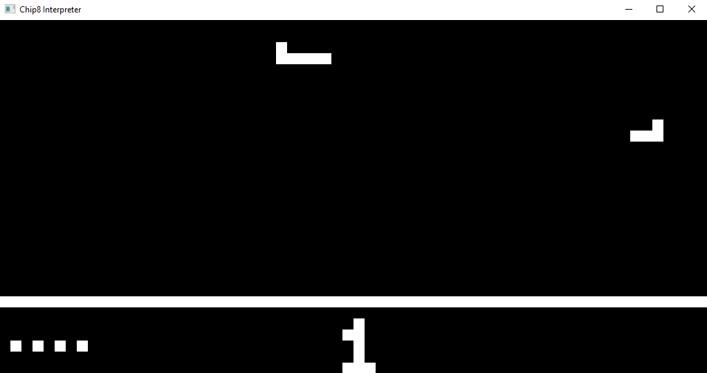

# Chip8 Interpreter
Generic chip8 interpreter written in rust using Pixels, Rodio, and Winit. Mostly targets the original COSMAC VIP interpreter.



Run by doing:

```cargo run [path_to_your_rom]```

Made heavily utilizing Tobias Langhoff's guide: https://tobiasvl.github.io/blog/write-a-chip-8-emulator/